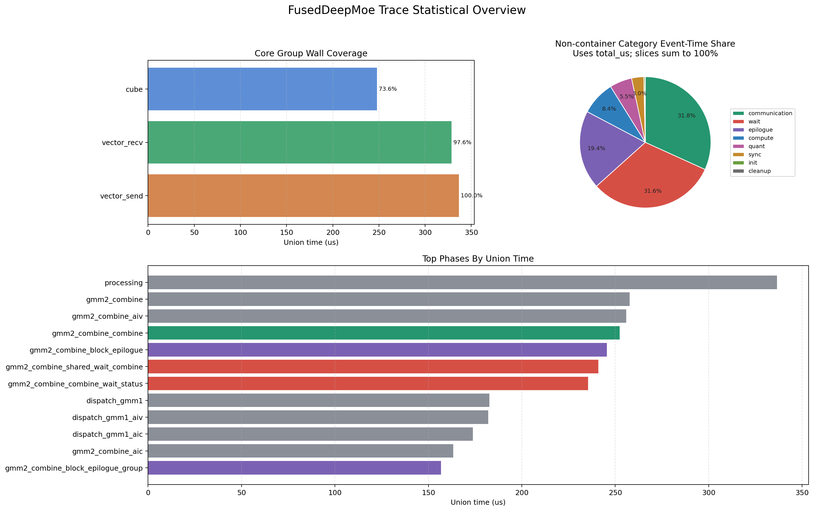

# MoE_Opt_trace_analysis · 设计说明

本文档描述 **`MoE_Opt_trace_analysis`**（编排 Step 4 / Skill 3）的定位、方案、输出文件与演进注意点。

这个 Skill 的核心对象是 `trace.json`。源码工程和算子名是可选上下文：如果用户提供源码目录和算子名，agent 可以进一步阅读打点源码、理解 trace label 的业务语义，并辅助维护 phase map。

## 0. 背景信息：算子打点到 trace.json

算子打点通常经历如下链路：

```text
operator source code
  -> trace point / timestamp record
  -> per-core or per-thread profiling buffer
  -> trace collector
  -> Chrome/Perfetto trace.json
  -> Trace Analysis Skill
```

因此，本项目默认不直接分析源码运行逻辑，而是分析 collector 已经生成的 `trace.json`。源码上下文的价值在于帮助解释 trace event 的含义，以及后续推荐新增或调整打点位置。

### 0.1 必需输入与可选上下文

Skill 的使用上下文建议分为三类：

- `TRACE_JSON`：必需，待分析的 trace 文件。
- `SOURCE_ROOT`：可选，算子源码工程目录，例如本仓库中的 `umdk`。
- `OPERATOR`：可选，算子名，例如 `fused_deep_moe`。

当前 CLI 直接消费的是：

```text
--trace <TRACE_JSON>
--phase-map <PHASE_MAP>
--output-dir <OUTPUT_DIR>
```

`SOURCE_ROOT` 与 `OPERATOR` 目前主要用于 agent 的 source-aware 分析：阅读源码、定位打点、理解 phase 语义、更新 phase map。

### 0.2 UMDK/FusedDeepMoe 示例

本仓库中的 `umdk` 目录是一个源码上下文示例。此前的默认配置主要围绕 UMDK `fused_deep_moe` 算子建立。

FusedDeepMoe 源码中常见打点形式如下：

```cpp
MoeTracing(TRACE_POINT("processing", "B"));
MoeTracing(TRACE_POINT("processing", "E"));
```

其中 label 表示业务阶段，例如 `processing`、`dispatch-gmm1`、`gmm2-combine block-epilogue shared-wait-combine`；事件类型通常是 Chrome Trace 风格的 `B` / `E`，即 begin/end。

UMDK 中的 `trace_preprocessor.py` 会扫描 `TRACE_POINT("label", "event_type")`，生成两类 ID：

- `event_id`：按 label 分配，同一个 label 共享同一个事件 ID。
- `point_id`：按源码调用位置分配，每个 `TRACE_POINT` 调用点唯一。

这意味着：

```cpp
TRACE_POINT("processing", "B")
TRACE_POINT("processing", "E")
```

拥有相同的 label/event_id，但它们是两个不同的 point_id。这样既能保留事件语义，也能定位具体源码位置。

### 0.3 时间戳读取与 buffer 存放

在 UMDK FusedDeepMoe 示例中，`MoeTracing(...)` 最终会记录：

- 当前打点 ID，包含 base point id 和可选 extra id。
- 当前硬件 cycle 时间戳。

`MoeTracingWithCycle` 使用 `AscendC::GetSystemCycle()` 读取系统 cycle。为了附带额外上下文，打点 ID 会被组合成 64 bit：

- 低 32 bit：`base_point_id`
- 高 32 bit：`extra_id`

profiling buffer 的结构大致为：

- 第 0 位：记录计数。
- 中间正向区域：存放 combined id。
- 尾部反向区域：存放 timestamp。
- 最后一位：initial timestamp，用于将绝对 cycle 转成相对时间。

collector 解析时会计算：

```text
diff_cycles = raw_timestamp - initial_timestamp
timestamp_us = diff_cycles / CLOCK_DIVISOR
```

UMDK 示例中 `CLOCK_DIVISOR = 50.0`，即 50 cycles 对应 1 us。

### 0.4 UMDK 1C2V 核组示例

当前默认 core group 规则来自 UMDK 1C2V trace。典型单卡 trace 覆盖 72 个核，并按 `[24, 24, 24]` 拆分：

- group 0：24 个 Cube/AIC 核。
- group 1：24 个 Vector recv 核。
- group 2：24 个 Vector send 核。

原始 72 个核在 1C2V 模式下会按如下方式映射：

```text
group 0: raw core 0..23
group 1: raw vector even cores, 24, 26, 28, ...
group 2: raw vector odd cores,  25, 27, 29, ...
```

在当前 Skill 中，三类核组被命名为：

```text
type0 -> cube
type1 -> vector_recv
type2 -> vector_send
```

如果其他算子的 trace 没有这类 `core_type` 约定，事件会落到 `unknown` 核组。后续可以把 core group 规则进一步配置化。

## 1. Skill 功能介绍与设计方案

本 Skill 的入口是 `app.py`，核心目标是把 `trace.json` 自动解析成结构化指标、统计图、Markdown 报告和可选 LLM 分析上下文。

### 1.1 执行模型

agent 执行时不应写死示例路径，而应根据用户描述替换输入：

```bash
python3 app.py \
  --trace <TRACE_JSON> \
  --phase-map <PHASE_MAP> \
  --output-dir <OUTPUT_DIR> \
  --top-n 20
```

如果使用默认 phase map，可以省略 `--phase-map`：

```bash
python3 app.py \
  --trace <TRACE_JSON> \
  --output-dir <OUTPUT_DIR> \
  --top-n 20
```

如果用户说明源码目录和算子名，例如：

```text
SOURCE_ROOT = umdk
OPERATOR = fused_deep_moe
```

agent 应先阅读相关源码打点，再决定是否需要补充或调整 `<PHASE_MAP>`。

### 1.2 输入与解析

`analyzers/parser.py` 支持两类 trace 文件：

- `{ "traceEvents": [...] }`
- 直接以事件数组 `[...]` 作为文件内容

事件解析支持：

- `ph == "X"`：完整区间事件，直接使用 `ts + dur` 得到结束时间。
- `ph == "B" / "E"`：按 `(pid, tid, name)` 维护栈，配对生成完整区间。

解析后的统一事件包含：

```text
name, ts_start, ts_end, dur, pid, tid, cat, ph, args
```

### 1.3 Phase 映射

Skill 通过 `--phase-map` 指定的 YAML 配置，把原始 trace name 映射到稳定 phase。

配置包含两类信息：

- `phases`：phase 到正则 pattern 列表的映射。
- `phase_categories`：phase 到 category 的归因。

Skill 会先对 trace name 做标准化：

- 去掉 `[extra:x]`
- 去掉尾部 `#seq`

如果多个 pattern 同时命中，`PhaseMapper` 会选择 pattern 字符串最长的规则，优先使用更具体的映射。

当前默认 `config/phase_map.yaml` 覆盖 UMDK FusedDeepMoe 的典型 label，例如：

```text
gmm2-combine block-epilogue shared-wait-combine [extra:0] #0
```

会映射到：

```text
gmm2_combine_shared_wait_combine
```

分析其他算子时，应提供新的 phase map 或扩展现有配置。

### 1.4 Category 归因

每个 phase 会进一步归到 category，主要类别包括：

- `container`
- `wait`
- `sync`
- `compute`
- `epilogue`
- `communication`
- `quant`
- `init`
- `cleanup`
- `other`

category 的主要用途是把大量具体 phase 压缩成可解释的瓶颈类型。例如 wait 偏同步等待，compute 偏计算，communication 偏发送/接收/状态流转。

### 1.5 核组与 tid 统计

Skill 会为每个已映射事件补充：

```text
core_type
core_group
core_kind
core_id
```

对于 UMDK 1C2V trace，默认核组为：

```text
core_group = cube / vector_recv / vector_send / unknown
```

对于其他 trace，仍然可以通过 `tid`、`pid`、`name` 和 phase/category 做通用统计。

### 1.6 指标口径

Skill 中最重要的两个耗时指标是 `total_us` 和 `union_us`。

`total_us` 是事件时长直接求和：

```text
total_us = sum(event.dur)
```

它会重复累计并行 tid/core，适合做事件耗时分布或饼图。

`union_us` 是同一类事件时间区间的并集长度：

```text
union_us = length(union([ts_start, ts_end]))
```

它更接近 wall time 覆盖，适合判断某个阶段是否覆盖了大部分端到端时间。

常见比例包括：

- `ratio_to_total_wall = union_us / trace_wall_time`
- `ratio_to_core_group_wall = union_us / 当前 core_group 的 union_us`

需要注意：`ratio_to_core_group_wall` 是覆盖率，不是互斥占比。不同 category/phase 可以在同一时间重叠，所以同一核组下的百分比不要求加和为 100%。

### 1.7 自动诊断

`analyzers/diagnosis.py` 提供确定性诊断规则，避免报告完全依赖 LLM。

当前诊断会重点关注：

- 主耗时 phase。
- 主瓶颈 category。
- wait 是否显著。
- wait 主要落在哪个 core group。
- 关键 phase 之间是否存在流水 overlap。
- 外层阶段是否存在明显未归因时间。

需要注意：当前部分规则仍包含 UMDK FusedDeepMoe 经验，例如 `dispatch_gmm1` 与 `gmm2_combine` 的 overlap 判断。后续应继续拆分为通用规则和 operator-specific 规则。

### 1.8 图表与文字摘要

如果环境中安装了 `matplotlib`，Skill 会默认生成：

```text
analysis_charts.png
```

当前图表包含三部分：

- `Core Group Wall Coverage`：展示 core group 的 wall 覆盖。
- `Non-container Category Event-Time Share`：使用非 container category 的 `total_us` 生成饼图。
- `Top Phases By Union Time`：展示 top phase 的 wall 覆盖。

图表会被自动嵌入 `report.md`。

同时，Skill 会生成确定性的文字摘要：

```text
statistical_summary.md
```

它会把图表中的关键信息转成可复制文本，包括核组覆盖、category 占比、每个核组的主导 category、top phase 等。

### 1.9 LLM Analysis

LLM 分析是可选能力。Skill 不内置具体模型或 API key，而是通过外部命令接入：

```bash
python3 app.py \
  --trace <TRACE_JSON> \
  --phase-map <PHASE_MAP> \
  --output-dir <OUTPUT_DIR> \
  --llm-analysis \
  --llm-command "<your-llm-cli>"
```

协议是：

```text
stdin:  Skill 生成的分析 prompt
stdout: LLM 返回的分析文本
```

如果未启用 LLM，Skill 仍会生成 `llm_prompt.md`，方便人工复制给 Codex 或其他模型。

## 2. 分析结果展示

以下内容来自当前示例 trace 的输出。实际使用时，agent 应替换为用户给定的 `<TRACE_JSON>` 和 `<OUTPUT_DIR>`：

```bash
python3 app.py \
  --trace <TRACE_JSON> \
  --phase-map <PHASE_MAP> \
  --output-dir <OUTPUT_DIR> \
  --top-n 20
```

### 2.1 输出文件

主要输出包括：

```text
report.md
analysis_charts.png
statistical_summary.md
summary.json
diagnosis.json
phase_instances.csv
phase_summary.csv
category_summary.csv
core_group_summary.csv
phase_core_group_summary.csv
category_core_group_summary.csv
name_summary.csv
phase_tid_summary.csv
overlap_summary.csv
bubble_summary.csv
llm_prompt.md
llm_analysis_meta.json
```

### 2.2 示例 Overview

当前仓库示例 trace 的概览如下：

| 指标 | 数值 |
| --- | --- |
| mapped intervals | 43928 |
| phases | 54 |
| raw names | 314 |
| pids | 16 |
| tids | 72 |
| core groups | cube, vector_recv, vector_send |
| wall time | 336.560 us |

这说明该示例 trace 覆盖了一张卡上的 72 个核，并且已经成功拆分为 cube、vector_recv、vector_send 三组。对于其他 trace，这些字段会根据实际 pid/tid/core group 自动变化。

### 2.3 统计图

当前报告会在 `Visualizations` 中展示统计图。本文档中的示例图片放在 `docs/analysis_charts.png`，与当前 Wiki Markdown 文件在同一目录，因此可以直接使用相对路径引用：



在实际分析输出中，`report.md` 与 `analysis_charts.png` 位于同一输出目录，因此报告中的相同相对路径在 GitHub 或 VS Code Markdown Preview 中可以直接显示。

### 2.4 Statistical Highlights

示例 trace 的文字摘要如下：

```text
Trace scope: 43928 mapped intervals, 54 phases, 72 tids, core groups=cube, vector_recv, vector_send, wall=336.560 us.

Core group wall coverage:
vector_send=336.560 us (100.0%), vector_recv=328.520 us (97.6%), cube=247.740 us (73.6%).

Top non-container categories by wall coverage:
communication=335.400 us (99.7%), wait=324.700 us (96.5%), epilogue=245.500 us (72.9%), compute=215.040 us (63.9%).

Category pie basis:
non-container category event-time share uses total_us, so slices sum to 100%.
communication=173776.020 us (31.8%), wait=172526.340 us (31.6%), epilogue=105961.280 us (19.4%), compute=45997.360 us (8.4%).

Leading category per core group:
cube: compute 200.640 us (81.0% of group);
vector_recv: wait 309.420 us (94.2% of group);
vector_send: communication 324.240 us (96.3% of group).
```

这个摘要说明：

- `vector_send` 覆盖了整个 trace wall time，`vector_recv` 也几乎全程活跃。
- 非 container 的主要事件耗时集中在 communication 与 wait。
- cube 侧主导 category 是 compute。
- vector_recv 侧主导 category 是 wait。
- vector_send 侧主导 category 是 communication。

### 2.5 Automatic Diagnosis

当前确定性诊断会把统计信号转成可读发现。对于示例 FusedDeepMoe trace，headline 是：

```text
主耗时阶段是 gmm2_combine_shared_wait_combine；瓶颈类型倾向于 wait
```

主要证据包括：

- `gmm2_combine_shared_wait_combine` 的 `union_us = 240.940 us`，约占 wall time 71.6%。
- `wait` category 的 `union_us = 324.700 us`，约占 wall time 96.5%。
- wait 主要出现在 `vector_recv` 核组，`vector_recv` 内 wait 覆盖该核组 94.2%。

对于其他算子，Automatic Diagnosis 仍会优先基于 top phase、category、core group/tid、overlap 和 bubble 给出结论；其中 FusedDeepMoe 特定规则需要结合实际 phase 命名判断适用性。

## 3. 未来发展空间和方向

当前 Skill 已经可以完成自动解析、统计、诊断、图表和 LLM prompt 生成。后续可以继续向“operator profile 化”“source-aware 分析”和“自动辅助打点设计”演进。

### 3.1 Operator Profile

当前不同算子主要通过 `--phase-map` 适配。后续可以引入 operator profile，把每个算子的配置收敛到独立目录：

```text
config/operators/<operator>/
  phase_map.yaml
  profile.yaml
```

`profile.yaml` 可以描述：

- 算子名。
- 源码扫描路径。
- phase map 路径。
- core group 规则。
- outer phases。
- operator-specific diagnosis rules。

这样 FusedDeepMoe 就会从“默认写在工程里的经验”变成第一个内置 operator profile。

### 3.2 Source-aware 分析

如果用户提供 `SOURCE_ROOT` 和 `OPERATOR`，agent 可以扫描源码中的 `TRACE_POINT(...)` 或读取 `point_map.json`，建立：

```text
trace raw name -> point id -> source file -> line
```

这样报告可以进一步回答：

- top raw name 来自哪个源码文件和行号。
- 哪些源码打点在 trace 中出现。
- 哪些源码打点没有出现在本次 trace 中。
- 哪些 trace name 没有被 phase map 覆盖。

### 3.3 自动发现打点盲区

未来可以结合 `bubble_summary.csv` 和 phase 层级关系，发现父阶段中未被子阶段覆盖的时间区间。如果某个父阶段长期存在较大未归因时间，可以自动提示：

```text
建议在某个父阶段内部增加更细粒度 TRACE_POINT
```

这类建议需要结合源码上下文，由 agent 给出候选位置，再由人工 review 后合入。

### 3.4 自动维护 phase_map

当算子新增 trace label 后，Skill 可以统计未映射 label，并给出 `phase_map.yaml` 的候选规则。

未来可以输出：

```yaml
candidate_phase_map:
  some_operator_phase:
    - "^some raw trace label"
```

这会让“新增打点 -> 更新分析配置”的成本更低。

### 3.5 更细粒度的核组和 tid 诊断

当前核组维度主要适配 UMDK 1C2V：

```text
cube / vector_recv / vector_send
```

后续可以继续细化：

- 每个 tid/core 的长尾阶段。
- 同一核组内最快/最慢 core 差异。
- 不同 rank 间的统计分布。
- 不同硬件或 runtime 的 core group 配置化。
- compute 与 wait/communication 的时序关系。

### 3.6 面向 LLM 的自动根因分析

当前 Skill 已经生成 `llm_prompt.md`，并支持外部 LLM 命令。后续可以将 LLM 的任务从“总结报告”扩展为：

- 根据统计表输出根因假设。
- 结合源码解释 wait/sync/communication 的来源。
- 自动给出下一轮实验建议。
- 自动生成新的 trace point patch 草稿。
- 对比两份 trace，解释性能变化。

理想路径是：

```text
trace.json
  -> 自动统计
  -> 定位可疑 phase/raw name
  -> 回查源码
  -> 推荐新增打点
  -> 下一轮 trace 验证
```

最终目标不是替代 Perfetto，而是把 Perfetto 前的第一轮筛查、归因和打点设计自动化。

## 附录：常用命令模板

基础运行：

```bash
python3 app.py \
  --trace <TRACE_JSON> \
  --phase-map <PHASE_MAP> \
  --output-dir <OUTPUT_DIR> \
  --top-n 20
```

运行测试：

```bash
python3 -m unittest discover -s tests
```

启用 LLM 分析：

```bash
python3 app.py \
  --trace <TRACE_JSON> \
  --phase-map <PHASE_MAP> \
  --output-dir <OUTPUT_DIR> \
  --llm-analysis \
  --llm-command "<your-llm-cli>"
```

关键输出：

```text
<OUTPUT_DIR>/report.md
<OUTPUT_DIR>/analysis_charts.png
<OUTPUT_DIR>/statistical_summary.md
<OUTPUT_DIR>/diagnosis.json
<OUTPUT_DIR>/llm_prompt.md
```
