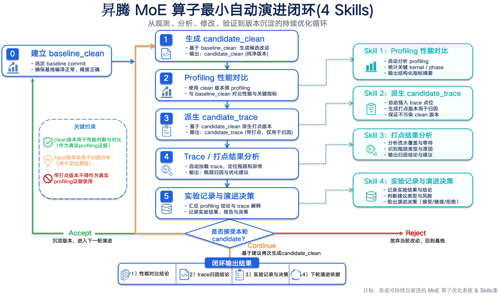

# MoE 算子自演进 Skill 集合

本仓库以子目录形式组织多套技能组件；各目录提供 `SKILL.md` 及可选脚本与模板，面向**昇腾 MoE 算子**的性能数据采集、对比分析与 trace 归因。各工具的职责边界由其目录内 `SKILL.md` 定义；跨阶段编排、构建标签及数据口径以同目录 **`moe_closed_loop_workflow.md`** 为准，不在各 Skill 文档中重复维护全流程对照说明。

四套自动化技能的目录名均以 **`MoE_Opt_`** 为前缀，并与 **`moe_closed_loop_workflow.md`** 中「**MoE_Opt_* 技能目录与 Workflow Step 对照**」表一致。若在 Cursor Rules / Skills 中曾挂载**旧路径**，请对齐当前目录：`op_summary_profiling_skill` → **`MoE_Opt_profiling`**；`trace_analysis_skill` → **`MoE_Opt_trace_analysis`**；`moe_evolution_record_skill` → **`MoE_Opt_experiment_record`**。**打点 / trace 构建 Skill**（目录 **`MoE_Opt_auto_trace`**）历史路径：`ascend_operator_instrumentation` → `MoE_Opt_instrumentation` → `MoE_Opt_auto_instrumentation` → `MoE_Opt_AutoTrace` → 现 **`MoE_Opt_auto_trace`**。

---

## Git 与工作区路径

本目录为 **单一 Git 仓库根**（`MoE_Opt_profiling`、`MoE_Opt_auto_trace`、`MoE_Opt_trace_analysis`、`MoE_Opt_experiment_record` **不再内含**各自的 `.git`）。开发与备份以根目录 **`git`** 为准。

**推荐协作用法**

1. 将仓库克隆（或迁移）至固定路径，例如 `~/src/moe-cursor-skills`。
2. 若在 Cursor 中习惯使用 **`~/.cursor/skills/`** 下的名字，可增加符号链接，例如：`ln -sfn ~/src/moe-cursor-skills ~/.cursor/skills/moe_cursor_skills`。
3. 在 Cursor Rules / Skills 配置中指向各子目录 **`SKILL.md`** 的**绝对路径**（随上述链接可变）。

忽略规则见根目录 **`.gitignore`**（内含 `__pycache__`、`*_op_summary_out/`、rank 落盘、`chrome_trace*` 等常见本地跑出物）。

**首次提交占位作者**：本仓库若在**未配置全局 Git 用户**的机器上初始化，会使用仅作用于本库的占位 `user.name` / `user.email`；推送远端前执行 `git config --local user.name "…"`、`git config --local user.email "…"` 即可。

**远程与标签**：按需 `git remote add origin <url>` 后 `git push -u origin main`；语义化发版建议使用 tag（例如 `git tag -a v0.5.0 -m '…'`）。

---

## 编排图示与正文对应关系

下列流程图与 **`moe_closed_loop_workflow.md`** 所列步骤定义一致：`candidate_clean` 可用前提下，闭环涵盖 **clean 侧 profiling 对比**、**按需开展的插桩与 trace 采集**、**trace 解析与归因**，以及 **实验记录与演进决策**。

图示静态资源路径：`ascend_moe_closed_loop_4skills.png`（与同目录 Markdown 一并纳入版本控制）。

流程的**线性文字说明**位于 **`moe_closed_loop_workflow.md`** 中 **「四 Skill 串联总览」** 一节，与图示一致：**`baseline_clean`** 与 **`candidate_clean`** 采集 profiling → **Skill 1**（`MoE_Opt_profiling`）→ 按归因需要执行 **Skill 2**（**`MoE_Opt_auto_trace`**／**auto_trace**，构建标签 **`candidate_trace`**）→ **Skill 3**（`MoE_Opt_trace_analysis`）→ **Skill 4**（`MoE_Opt_experiment_record`）→ 责任方依据 **`next_action.md`** 制备下一轮 **`candidate_clean`**。

---

## 各子目录职责概要

### `MoE_Opt_profiling/`（Profiling 对比）

处理来源于 **`baseline_clean`**、**`candidate_clean`** 的 **`op_summary` 类 CSV**。对比模式下输出 **`profile_summary.json`**、**`profile_compare.json`**、**`profiling_report.md`**、**`performance_decision_hint.json`** 及既有 **`report.md`** 等产物；亦可按单 CSV 做单算子下钻。**性能优劣结论仅能基于上述 clean 路径数据**；本工具不承载 **`candidate_trace`** 条件下的归因语义。

### `MoE_Opt_auto_trace/`（**auto_trace**：自动打点；`candidate_trace` 与 Chrome trace）

**MoE_Opt_auto_trace（auto_trace）** 在算子工程内交付 **TRACE_POINT / MoeTracing 自动插桩**、编译预处理、sample 落盘与可选 **Chrome trace**。**该 Skill 对应构建**服务于**阶段耗时与流水线行为归因**；其构建产物与专用于数值对比的 clean 构建通常不一致，故**不得以插桩路径上的 profiling 表作为最终性能优劣判据**。

### `MoE_Opt_trace_analysis/`（Trace 解析与统计）

对 **`trace.json`** 解析并映射 phase，输出耗时分布、overlap、图表与人读报告。**其证据链独立于 `op_summary`**；归档或撰写结论时须**分列数据来源与口径**，禁止在无标注情况下将 profiling 数值结论与 trace 统计结论在同一语句中合并表述。

### `MoE_Opt_experiment_record/`（实验收口）

汇总 **`MoE_Opt_profiling/`**（Skill 1）与 **`MoE_Opt_trace_analysis/`**（Skill 3）及 **`candidate_clean`** 侧变更元数据，形成可追溯实验材料与决策占位；**不适用补丁、不改算子源码**。标准产出包括 **`experiment_report.md`**、**`decision.yaml`**、**`next_action.md`**、**`candidate_change_suggestion.md`**、**`evolution_index.jsonl`** 及 **`experiment/`** 归档目录。建议采用 **`scripts/build_experiment_closure.py`** 配合 manifest，以保证与各阶段产物文件名及字段约定一致。**`baseline_clean` / `candidate_clean` / `candidate_trace`** 的用法约束见 **`moe_closed_loop_workflow.md`**。

迭代在 **`next_action.md`** 定稿后，由工程师实现下一版本 **`candidate_clean`** 并重新采集 profiling。**`candidate_change_suggestion.md`** 为实施方案层面的文字建议；若后续扩展「自动补丁生成」类技能，可将其作为结构化上游输入预留。

---

## 典型路径（对照 workflow「流程变体」）

| 场景 | 建议覆盖 Skill / 步骤 | 备注 |
|------|------------------------|------|
| 仅需基于表格的性能对比结论 | Skill 1；Skill 4 可选 | 未执行 trace 时须在收口材料中标明归因证据缺失 |
| 性能结论与阶段级归因兼具 | Skill 1 → Skill 2 → Skill 3 → Skill 4 | profiling 与 trace 结论分列书写，红线逐项自检 |

按需裁剪的细节见 **`moe_closed_loop_workflow.md`** 中「流程变体」与各步输入／产出快照表。

---

## 推荐使用顺序

1. 阅读 **`moe_closed_loop_workflow.md`**，确定本轮涉及的步骤边界及 **`clean`** 与 **`candidate_trace`** 的隔离要求。  
2. 若仅需基于 **`op_summary` 表**的结论，参阅 **`MoE_Opt_profiling/SKILL.md`**，按 **`app.py`** 指定 CSV（及 **`--manifest`** 等）；单算子下钻时使用 **`--op-type`** 等参数。  
3. 如需 **auto_trace** 打点与 trace 采集，参阅 **`MoE_Opt_auto_trace/SKILL.md`**，依门禁修改源码、编译，并使 **`trace.json`**（及 **`point_map.json`** 等）落盘至约定绝对路径。  
4. 在已具备 **`trace.json`** 时，参阅 **`MoE_Opt_trace_analysis/SKILL.md`**，通过 **`app.py`** 指定输入 trace 与输出目录。  
5. 如需本轮实验收口，参阅 **`MoE_Opt_experiment_record/SKILL.md`**，汇集 **`MoE_Opt_profiling`**、**`MoE_Opt_trace_analysis`**（若已执行）与 **`candidate_clean`** 侧的工件路径及 manifest；进入 **`MoE_Opt_experiment_record/`** 目录后执行 **`python3 scripts/build_experiment_closure.py`**（或使用与 manifest 等价的手写归档）。该步骤不对算子仓库施加代码变更；若本轮未执行 trace，须在 **`experiment_report`** 及 **`decision.yaml`** 的 rationale 中声明证据缺口。

各命令的参数、环境与依赖以实现目录内的 **`SKILL.md`**、**`requirements.txt`** 为准；文中路径均需替换为目标环境的绝对路径。

---

## 文档与图示维护约定

闭环步骤、构建标签或工具集契约发生变更时，应**先行修订** **`moe_closed_loop_workflow.md`**，再同步各子目录实现及其 **`SKILL.md`**，最后在本仓库提交一次独立 commit（便于他人 `pull`）。若更新流程图内容，应以新文件覆盖 **`ascend_moe_closed_loop_4skills.png`**，并检查仓库内引用该文件名的其他文档是否需要同步修改。
